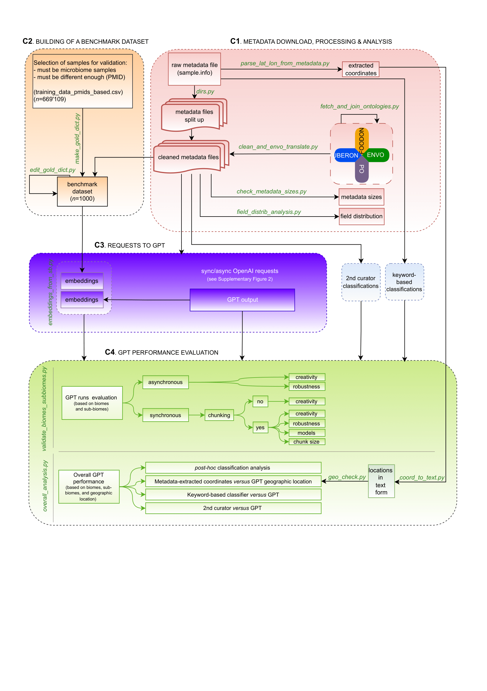

## 📚 Table of Contents

- [Introduction](#introduction)
- [Requirements](#requirements)
- [Container 1: Metadata Splitting and Cleaning](#container-1)
  - [🚀 Run Container 1](#run-container-1)
    - [1. Split the Metadata File](#split-the-metadata-file)
    - [2. Fetch Ontologies](#fetch-ontologies)
    - [3. Clean Metadata Files](#clean-metadata-files)
    - [4. Check Metadata Size Reduction](#check-metadata-size-reduction)
    - [5. Analyze Metadata Fields Distribution](#analyze-metadata-fields-distribution)
    - [6. Parse Latitude and Longitude](#parse-latitude-and-longitude)
- [Container 2: Benchmark Annotation via Interactive Interface](#container-2)
  - [🚀 Run Container 2](#run-container-2)
- [Container 3: GPT Interaction](#container-3)
  - [🚀 Run Container 3](#run-container-3)
    - [1. Synchronous GPT Interaction](#synchronous-gpt-interaction)
    - [2. Asynchronous GPT Interaction](#asynchronous-gpt-interaction)
    - [3. Create Embeddings](#create-embeddings)
- [Container 4: GPT performance evaluation](#container-4)
  - [🚀 Run Container 4](#run-container-4)
    - [1. Compare GPT runs](#compare-gpt-runs)
    - [2. Overall analysis](#overall-analysis)
    - [3. Convert coordinates to places](#convert-coordinates-to-places)
    - [4. Geographic location: GPT versus metadata](#geographic-location-gpt-versus-metadata)


---
<a name="introduction"></a>
# Introduction: 

This repository contains a modular, containerized pipeline for processing and annotating environmental sample metadata as part of the **MicrobeAtlasProject**. Each container encapsulates a specific set of tasks — as you see depicted below - from preprocessing metadata (C1 - 🔴 red), creating a benchmark dataset (C2 - 🟠 orange), interacting with GPT models and generating embeddings (C3 - 🟣 purple), to GPT output evaluation (C3 - 🟢 green). 




Let's start with the requirements!

---
<a name="requirements"></a>
## 📦 Requirements: 


### 1) Clone the repo into your home directory:

```
cd ~
git clone link_to_clone_repo
```


### 2) Download large files and move to folder: 

- Make a directory: 
```
cd ~
mkdir MicrobeAtlasProject
```
- Download these large files: `sample.info.gz`, `metadata.out`, `...`
- Place them into ~/MicrobeAtlasProject/.


### 3) Ensure the following directories exist on your machine: 

```
~/MicrobeAtlasProject/
~/github/metadata_mining/scripts/
```

### 4) Install Docker

Download and install Docker Desktop: 

- [Download Docker Desktop](https://www.docker.com/products/docker-desktop) (macOS/Windows)
- [Install Docker Engine](https://docs.docker.com/engine/install/) (Linux)

### 5) Verify the installation and launch Docker: 

```
docker --version
open -a Docker
```

### 6) Build the docker image: 

```
docker build -t metadmin .
```
<a name="container-1"></a>
## Container 1: Metadata Splitting and Cleaning

This Docker container is part of the **MicrobeAtlasProject** pipeline. It provides a consistent environment to run all scripts related to processing and cleaning environmental metadata, including coordinate parsing, ontology translation, and exploratory analysis.


---

<a name="run-container-1"></a>
### 🚀 Run Container 1: 

<a name="split-the-metadata-file"></a>
#### 1. Split the metadata file 🧾 into individual files: 

```
docker run -it --rm \
  -v ~/MicrobeAtlasProject:/MicrobeAtlasProject \
  -v ~/github/metadata_mining/scripts:/app/scripts \
  metadmin \
  python /app/scripts/dirs.py \
    --input_file sample.info_test.gz \
    --output_dir sample_info_split_dirs_test \
    --figure_path files_distribution_in_dirs_test.pdf
```

<a name="fetch-ontologies"></a>
#### 2. Fetch ontologies  🌐: 

```
docker run -it --rm \
  -v ~/MicrobeAtlasProject:/MicrobeAtlasProject \
  -v ~/github/metadata_mining/scripts:/app/scripts \
  metadmin \
  python /app/scripts/fetch_and_join_ontologies.py \
    --wanted_ontologies FOODON ENVO UBERON PO \
    --output_file ontologies_dict
```

<a name="clean-metadata-files"></a>
#### 3. Clean metadata files and replace ontology codes with labels  🧼: 

Increase the file descriptor limit first. By default, many operating systems limit how many files can be open at once. Since this script processes many files in parallel, you must increase the ulimit:

```
ulimit -n 200000
docker run -it --rm \
  -v ~/MicrobeAtlasProject:/MicrobeAtlasProject \
  -v ~/github/metadata_mining/scripts:/app/scripts \
  metadmin \
  python /app/scripts/clean_and_envo_translate.py \
    --ontology_dict ontologies_dict.pkl \
    --metadata_dirs sample_info_split_dirs_test \
    --max_processes 8
```

<a name="check-metadata-size-reduction"></a>
#### 4. Check metadata size reduction 📉 : 

This script compares file sizes before and after cleaning and estimates the token-level reduction after the cleaning. It calculates token reduction using bootstrap sampling (default: 100 iterations × 100 samples).

```
docker run -it --rm \
  -v ~/MicrobeAtlasProject:/MicrobeAtlasProject \
  -v ~/github/metadata_mining/scripts:/app/scripts \
  metadmin \
  python /app/scripts/check_metadata_sizes.py
```

<a name="analyze-metadata-fields-distribution"></a>
#### 5. Analyze metadata fields distribution 🧠 : 

This script examines in which metadata fields the benchmark sub-biome information appears. It scans the cleaned metadata files and checks whether the sub-biome (e.g. human gut, sediment, leaf) is found fully or partially in each metadata field. This helps identify the most informative fields across samples and biomes. It outputs a plot and csv summaries with the top-matching fields, based on 1000 random files. 

```
docker run -it --rm \
  -v ~/MicrobeAtlasProject:/MicrobeAtlasProject \
  -v ~/github/metadata_mining/scripts:/app/scripts \
  metadmin \
  python /app/scripts/field_distrib_analysis.py \
    --gold_dict gold_dict.pkl 
```

<a name="parse-latitude-and-longitude"></a>
#### 6. Parse latitude and longitude 🌍: 

```
docker run --rm \
  -v ~/MicrobeAtlasProject:/MicrobeAtlasProject \
  -v ~/github/metadata_mining/scripts:/app/scripts \
  metadmin \
  python /app/scripts/parse_lat_lon_from_metadata.py \
    --reversal_file samples_with_lat_lon_reversal.tsv \
    --metadata_file metadata.out \
  | grep '^OUTPUT:' \
  | cut -f1-5 \
  | tr '\t' ' ' \
  | sed 's/  */ /g' \
  | sed 's/ *$//' \
  > ~/MicrobeAtlasProject/sample.coordinates.reparsed.filtered_fresh
```

<a name="container-2"></a>
## Container 2: Benchmark Annotation via Interactive Interface

This container supports the creation and manual curation of a benchmark (also referred to as gold standard dictionary - gold_dict.pkl), which maps selected sample IDs to: 
- a biome (animal, plant, soil, water, other)
- a specific sample origin (sub-biome)
- geographic coordinates (latitude/longitude)
- a short geographic location description

This container includes two interactive scripts: 
- make_gold_dict.py: read the metadata from each sample and annotate samples yourself.
- edit_gold_dict.py: modify or correct existing entries (when you realise you made a mistake).

⚠️ These scripts use input() prompts, so they must be run inside an interactive Docker session as running them directly with conda run or piping won't work properly.


---

<a name="run-container-2"></a>
### 🚀 Run Container 2: 

Launch Docker container interactively:

```
docker run -it --rm \
  --entrypoint bash \
  -v ~/MicrobeAtlasProject:/MicrobeAtlasProject \
  -v ~/github/metadata_mining/scripts:/app/scripts \
  metadmin
```

Activate the environment inside the container:

```
conda activate metadmin_env
```

To create the benchmark from scratch or to continue making it, run: 

```
python /app/scripts/make_gold_dict.py
```

This starts a session where you can annotate samples one by one. Your progress is automatically saved to gold_dict.pkl.

To edit entries in the existing dictionary:

```
python /app/scripts/edit_gold_dict.py
```

To exit either session just type:
```exit```

💾 In both cases your changes are automatically saved to /MicrobeAtlasProject/gold_dict.pkl, which is mounted from your local system.


---

<a name="container-3"></a>
## Container 3: GPT interaction

This container handles all steps related to GPT-based annotation of metadata, including: synchronous or asynchronous interactions with the OpenAI API, preparing and submitting batch jobs (asynchronous runs), fetching responses (asynchronous runs), generating sub-biome embeddings from GPT outputs and from benchmark data. 

⚠️ Before running this container, you will need to acquire your API key and place it in ~/MicrobeAtlasProject. You could generate two separate keys: one for the chat completion (annotation of metadata), one for creating embeddings. In this pipeline the two are named: my_api_key and my_api_key_embeddings. The reason for this is keeping track of usage quotas for each task. 


<a name="run-container-3"></a>
### 🚀 Run Container 3: 

You can run either:

- Synchronous interaction with OpenAI
- Asynchronous interaction via the batch API (two steps)

Then, generate embeddings from GPT results and from benchmark data.

<a name="synchronous-gpt-interaction"></a>
#### Synchronous GPT interaction: 

This script performs end-to-end metadata annotation in a single script using synchronous OpenAI API requests.


```
docker run -it --rm \
  -v ~/MicrobeAtlasProject:/MicrobeAtlasProject \
  -v ~/github/metadata_mining/scripts:/app/scripts \
  metadmin \
  python /app/scripts/openai_main.py \
    --work_dir . \
    --input_gold_dict gold_dict.pkl \
    --n_samples_per_biome 5 \
    --chunking no \
    --chunk_size 2000 \
    --seed 22 \
    --directory_with_split_metadata sample_info_split_dirs \
    --system_prompt_file openai_system_better_prompt_json.txt \
    --encoding_name cl100k_base \
    --api_key_path my_api_key \
    --model gpt-3.5-turbo-1106 \
    --temperature 1.00 \
    --max_tokens 4096 \
    --top_p 0.75 \
    --frequency_penalty 0.25 \
    --presence_penalty 1.5 \
    --max_requests_per_minute 3500 \
    --opt_text normal \
    --output_format json
```

<a name="asynchronous-gpt-interaction"></a>
#### Asynchronous GPT interaction (2 steps): 

Use this if you want to take advantage of OpenAI's batch API for more efficient, large-scale requests.

- Step 1: Submit Batch Job (async requests)

This script prepares metadata and submits it as an OpenAI batch job.


```
  docker run -it --rm \
  -v ~/MicrobeAtlasProject:/MicrobeAtlasProject \
  -v ~/github/metadata_mining/scripts:/app/scripts \
  metadmin \
  python /app/scripts/gpt_async_batch.py \
    --work_dir . \
    --input_gold_dict gold_dict.pkl \
    --n_samples_per_biome 5 \
    --chunking "no" \
    --chunk_size 3000 \
    --seed 22 \
    --directory_with_split_metadata "sample_info_split_dirs" \
    --system_prompt_file "openai_system_prompt.txt" \
    --encoding_name "cl100k_base" \
    --api_key_path "my_api_key" \
    --model "gpt-3.5-turbo-1106" \
    --temperature 1.00 \
    --max_tokens 4096 \
    --top_p 0.75 \
    --frequency_penalty 0.25 \
    --presence_penalty 1.5 \
    --output_format "inline"
```

- Step 2: Fetch Batch Results

After your batch job is submitted, OpenAI typically processes it within a few minutes to a few hours. However, the maximum processing time is 24 hours. If your job hasn't completed within that window, it will expire, and you'll need to resubmit it.

We have successfully submitted up to 700,000 metadata samples per day and consistently received results well within 24 hours.

To fetch and save completed results locally, run:


```
docker run -it --rm \
  -v ~/MicrobeAtlasProject:/MicrobeAtlasProject \
  -v ~/github/metadata_mining/scripts:/app/scripts \
  metadmin \
  python /app/scripts/gpt_async_fetch_and_save.py \
    --work_dir . \
    --api_key_path my_api_key

```

<a name="create-embeddings"></a>
#### Create Embeddings: 

This script creates text-embedding-3-small vectors from:

- GPT-generated sub-biomes (gpt_clean_output*.csv / .txt)
- Your benchmark sub-biomes (gold_dict.pkl)


```
docker run -it --rm \
  -v ~/MicrobeAtlasProject:/MicrobeAtlasProject \
  -v ~/github/metadata_mining/scripts:/app/scripts \
  metadmin \
  python /app/scripts/embeddings_from_sb.py \
    --directory_path . \
    --api_key_path my_api_key_embeddings \
    --gold_dict_path gold_dict.pkl
```


---

<a name="container-4"></a>
## Container 4: GPT performance evaluation

This container evaluates GPT performance by comparing biomes and sub-biomes annotations by GPT (.tsv files for biomes and .json files for sub-biomes) against those of the benchmark (gold_dict.pkl). It does so for each GPT run. For biomes annotation evaluation, it compares strings for either a lenient or an exact match. It produces a summary CSV with per-run biome agreement metrics. For sub-biomes annotation evaluation, it uses embeddings of GPT runs versus embeddings of the benchmark. It computes cosine similarity between matched embeddings, it calculates the distribution of similarities versus the background, and it produces a summary CSV with per-run sub-biome similarity metrics. Pairwise statistical comparisons are performed. Additionally, it evaluates geographic annotations by GPT by comparing them to the metadata-extracted coordinates. 


<a name="run-container-4"></a>
### 🚀 Run Container 4: 

Four scripts to run:

- One to obtain the metrics .... validate_biomes_subbiomes.py
- overall_analysis.py
- coord_to_text.py
- geo_check.py

.....

<a name="compare-gpt-runs"></a>
#### Compare GPT runs: 

This script ......


```
docker run -it --rm \
  -v ~/MicrobeAtlasProject:/MicrobeAtlasProject \
  -v ~/github/metadata_mining/scripts:/app/scripts \
  metadmin \
  python /app/scripts/validate_biomes_subbiomes.py \
    --work_dir . \
    --map_file gpt_file_label_map.tsv
```
<a name="overall-analysis"></a>
#### Overall analysis: 

This script ...... needs to run interatcively because you may need to choose files in case few files have the same label. Launch Docker container interactively:

```
docker run -it --rm \
  --entrypoint bash \
  -v ~/MicrobeAtlasProject:/MicrobeAtlasProject \
  -v ~/github/metadata_mining/scripts:/app/scripts \
  metadmin
```

Activate the environment inside the container:

`conda activate metadmin_env`


To select files... run:

```
python /app/scripts/overall_analysis.py \
       --work_dir . \
       --metadata_dir sample_info_split_dirs \
       --keyword_based_annot_file joao_biomes_parsed.csv
```

This starts a session where you can achoose files when they have same label. 

To exit the session just type: `exit`

<a name="convert-coordinates-to-places"></a>
#### Convert coordinates to places: 

This script performs reverse geocoding on a set of unique latitude/longitude coordinates. This means it convertseach coordinate pair into a humna-readable place name (like a city, region, or country). It uses the Nomatin geocoding service OpensStreetMap. It may take long to run as we are using the free version (no API). Approximately you can expect it to take 1.3 seconds per coordinates pair. 


```
docker run -it --rm \
  -e PYTHONUNBUFFERED=1 \
  -v ~/MicrobeAtlasProject:/MicrobeAtlasProject \
  -v ~/github/metadata_mining/scripts:/app/scripts \
  metadmin \
  python -u /app/scripts/coord_to_text.py \
    --work_dir . \
    --coordinates_file sample.coordinates.reparsed.filtered \
    --output_file geocoded_coordinates.csv \
    --min_delay_seconds 1.3
```

You can check the progress by running from another terminal: 

`tail -f ~/MicrobeAtlasProject/geocoding_progress.log`


<a name="geographic-location-gpt-versus-metadata"></a>
#### Geographic location: GPT versus metadata: 

This script needs to run interactively because it gives you the possibility to evaluate a set of GPT geographic locations versus the extracted coordinates. You will pick "who" was correct: coordinates-derived geographic location (from metadata) or GPT-derived geographic location. This will help you qualify the mismatches between the two. Start by launching the Docker container interactively:

```
docker run -it --rm \
  --entrypoint bash \
  -v ~/MicrobeAtlasProject:/MicrobeAtlasProject \
  -v ~/github/metadata_mining/scripts:/app/scripts \
  metadmin
```

Activate the environment inside the container:

`conda activate metadmin_env`

Then run:

```
python /app/scripts/geo_check.py \
    --work_dir . \
    --metadata_dir sample_info_split_dirs \
    --api_key_file /MicrobeAtlasProject/google_maps_api_key \
    --coordinates_file sample.coordinates.reparsed.filtered \
    --translated_coordinates geocoded_coordinates.csv \
    --random_misclassified_samples_dict random_misclassified_samples_dict.pkl \
    --output_map_all_matches map_with_color_coded_points_all.html \
    --output_map_all_mismatches map_with_color_coded_points_mismatches.html
```

You can quit at any time 'QUIT'. 

To exit the session just type: `exit`


